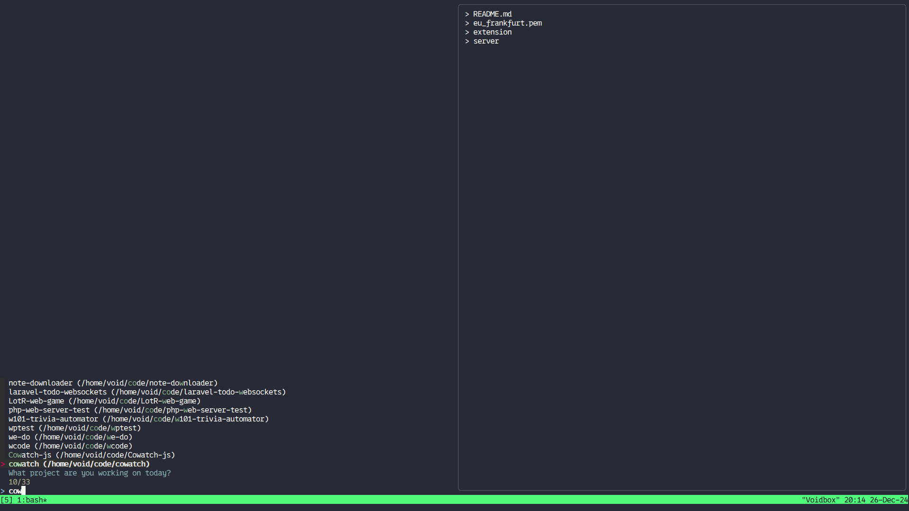

# wcode - Unf*ck your project folder

> For side-project collectors of all ages and genders.
wcode (which code) provides a simple way to find and navigate to the correct project directory.

As the tool is primarily indended for personal use, I haven't made it simple to install or use, **yet...**



## 🌱 How to install
**Prerequesites**
You must have [fzf](https://github.com/junegunn/fzf) installed.

1. Clone the repo.
2. Set variable WCODE_PATHS with all the paths (space separated) the tool will look for projects
3. Profit?!?

## 🌷 How to use
To use you just need to run it using:
```sh
go run main.go; cd `cat $HOME/.config/wcode/selection`
```

The DOT `.` is important. We need it to change directory once we select the project. It is a shorthand for source, which runs the code in the current shell instance.

## 🧑‍🌾 How to contribute
Feel free to suggest any additions or changes by creating a pull request.
